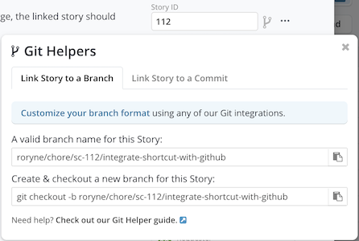

# Contributing Guide

This document describes the workflow conventions for this repository.

## Referencing Shortcut Stories in Branches & Pull Requests

To keep work traceable between code and Shortcut, **every branch and PR must reference its related Shortcut story**.

### Branch Naming

Use the following format:

```
[owner_username]/[story_type]/[story_id]/[story_name]
```

Use Shortcut's built-in git helpers for convenience:



This is found in the top right of any story.

**Example branch names:**

- `roryne/chore/sc-122/create-a-test-pr-that-references-a-live-story`
- `roryne/chore/sc-112/integrate-shortcut-with-github`

### Pull Requests

Use Shortcut as the single source of truth for requirements and story documentation. PR descriptions should remain minimal (link + high-level summary) and avoid duplicating detailed story notes.

---

## Commit Messages

- Keep commits **atomic and descriptive**.
- Follow [Conventional Commits](https://www.conventionalcommits.org/):

### Basic structure

```
<type>[optional scope]: <description>

[optional body]

[optional footer(s)]
```

- `fix:` patches a bug in your codebase (correlates with **PATCH** in SemVer).
- `feat:` introduces a new feature (correlates with **MINOR** in SemVer).
- `BREAKING CHANGE:` in a footer, or `!` after type/scope, introduces a breaking API change (correlates with **MAJOR** in SemVer).

### Common Types

| Type         | Description                                                                   |
| ------------ | ----------------------------------------------------------------------------- |
| **feat**     | A new feature.                                                                |
| **fix**      | A bug fix.                                                                    |
| **docs**     | Documentation changes only.                                                   |
| **style**    | Code style changes (formatting, semicolons, whitespace) with no logic change. |
| **refactor** | Code change that neither fixes a bug nor adds a feature.                      |
| **perf**     | Code change that improves performance.                                        |
| **test**     | Adding or updating tests.                                                     |
| **build**    | Changes to build system or external dependencies (npm, yarn, vite, etc.).     |
| **ci**       | Changes to CI configuration (GitHub Actions, pipelines, etc.).                |
| **chore**    | Routine maintenance, tooling, or other tasks (no production code changes).    |
| **revert**   | Reverts a previous commit.                                                    |

> fix: a commit of the type fix patches a bug in your codebase (this correlates with PATCH in Semantic Versioning).

> feat: a commit of the type feat introduces a new feature to the codebase (this correlates with MINOR in Semantic Versioning).

> BREAKING CHANGE: a commit that has a footer BREAKING CHANGE:, or appends a ! after the type/scope, introduces a breaking API change (correlating with MAJOR in Semantic Versioning). A BREAKING CHANGE can be part of commits of any type.

### Examples

**Commit message with description and breaking change footer**

```
feat: allow provided config object to extend other configs

BREAKING CHANGE: `extends` key in config file is now used for extending other config files
```

**Commit message with scope and ! to draw attention to breaking change**

```
feat(api)!: send an email to the customer when a product is shipped

```

---

## Code Reviews

- Open a PR as soon as your branch is ready for review.
- Tag reviewers who own the affected area of code.
- Keep PRs small and focused (prefer multiple smaller PRs over one large one).
- Address feedback promptly and keep discussion in GitHub (technical) vs. Shortcut (requirements).
- Resolve conversations after making changes so reviewers have clear visibility.

---

## Testing Expectations

- **Unit tests** for all new functions/components.
- **Component/UI tests** for visual and interactive elements.
- **Integration tests** where logic spans multiple modules.
- Run the full test suite locally before pushing.
- Do not rely solely on CI to catch test failures — tests should pass before you open a PR.

---

## Documentation

- Update or create docs under `docs/` whenever you add a new feature or change existing behavior.
- Include code examples and usage notes where helpful.
- Keep PRs and docs aligned — don’t merge code that isn’t reflected in the documentation.

---

## GitHub Workflows

- **CI must pass** before merging.
- Do not bypass checks with `--no-verify` or `--force`.
- Merge using **Squash & Merge** to keep commit history clean.
  - Edit the squash commit message to follow the [Conventional Commits](#commit-messages) format.
- Avoid pushing directly to `main` or force-pushing shared branches.

---

## Release Process

- The `main` branch is always deployable.
- Use tags to mark releases:
  - v1.2.0
  - v1.2.1
- Follow Semantic Versioning:
- **MAJOR** – breaking changes
- **MINOR** – new features, backwards compatible
- **PATCH** – bug fixes

---

## Summary

- Branches and PRs must link back to a Shortcut story.
- Keep story documentation in Shortcut, and PRs minimal.
- Write clean commits using [Conventional Commits](#commit-messages).
- Keep PRs small, reviewable, and up to date with tests and docs.
- Ensure CI passes before merging.
- Follow release tagging conventions.

---

## Contributor Checklist

Before opening or merging a PR, make sure you have:

- [ ] Created your branch using the correct format:  
       `[owner_username]/[story_type]/[story_id]/[story_name]`
- [ ] Linked the branch/PR to the appropriate Shortcut story
- [ ] Written **atomic, descriptive commits** that follow [Conventional Commits](#commit-messages)
- [ ] Ensured your PR description includes a Shortcut story link + high-level summary
- [ ] Added or updated tests (unit, component, integration as needed)
- [ ] Updated documentation in `docs/` if behavior has changed
- [ ] Run the full test suite locally and confirmed it passes
- [ ] Verified that CI checks pass in GitHub
- [ ] Kept your PR focused and reviewable (small, scoped changes)
- [ ] Edited the squash commit message to follow [Conventional Commits](#commit-messages)
- [ ] Confirmed `main` is deployable after merge

Use this checklist to keep contributions consistent and maintainable.
